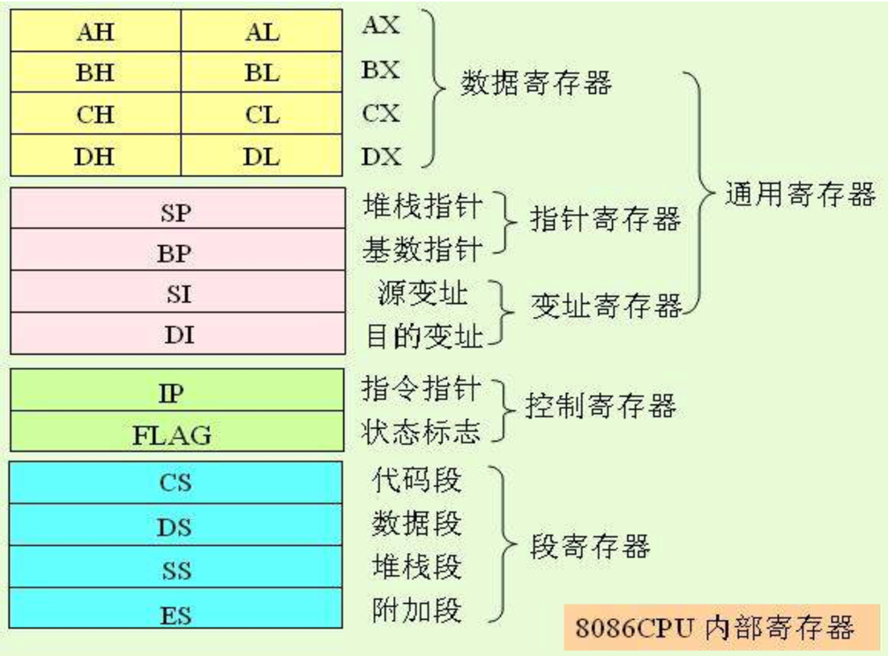

# 问题解答

## 1.请简述80x86系列的发展历史  

x86泛指一系列英特尔公司用于开发处理器的指令集架构，这类处理器最早为1978年面市的「Intel 8086」CPU。后续成员有包括80186、80286、80376以及80486。现在英特尔将其称为IA-32，全称为"**I**ntel **A**rchitecture, **32**-bit"。  

- 1978年6月，intel推出第一款16位微处理器8086，采用20位地址线
- 1982年发布80286，主频提高至12MHz
- 1985年发布80386，处理器变为32位，地址线扩展至32位
- 1989年发布80486，1993年发布80586并命名为奔腾

2003年AMD拓展了该架构，命名为AMD64，之后英特尔也推出了与之相兼容的处理器，并命名为Intel 64。两者一般被统称为x86-64或x64。开创了x86的64位时代。  
另外一点是英特尔早在1990年和绘图合作提出了一种用在安藤系列处理器中的独立的64位架构，被称为IA-64。但这是一种崭新的系统，和x86完全没有相似性；不应该把它和x86-64或x64弄混。  
x86架构的特点是使用了可变长的复杂指令集。采用小端存储方式。  
参考：[维基百科x86](https://zh.wikipedia.org/zh/X86)  

## 2.请说明小端和大端的区别，并说明80x86系列采用了哪种方式

大端(Big-endian): 指数据的高字节保存在内存的低地址中，类似于字符串的按顺序存储，与阅读习惯一致。  
小端(Little-endian): 指数据的高字节保存在内存的高地址，将地址的高低和数据位权有效地结合起来，计算数值大小很方便。  
80x86使用小端存储模式。  

## 3.80x86有哪五类寄存器，并分别举例说明其作用

  
共有五类寄存器：数据寄存器、指针寄存器、变址寄存器、控制寄存器、段寄存器  
数据寄存器通常用于保存临时数据，其中rax为64位，eax为rax的低32位，ax为eax低16位，ah为ax高八位，al为ax低八位。其他3个寄存器类似。  
指针寄存器保存当前进程的内存空间相关指针。SP为堆栈指针，与SS配合使用，指向目前的堆栈顶位置。BP为基址指针寄存器，可用作SS的一个相对基址位置。  
变址寄存器用于...晚点再研究。SI为源变址寄存器，可用来存放相对于DS段的源变址指针。DI为目的变址寄存器，可用来存放相对于ES段的目的变址指针。  
控制寄存器保存着进程运行过程中的产生的一些状态。  
段寄存器用于使用分段式存储程序的物理内存的寻找。  

## 4.什么是寻址？立即寻址和直接寻址的方式有什么不同

找到操作数的地址（从而能够取出操作数）叫做寻址。  

- 立即寻址：  
`MOV   AX   1234H`       #直接给出了操作数，事实上没有“寻址”。
- 直接寻址  
`MOV   AX   [1234H]`       #直接给出了地址1234H,用[]符号取数

## 5.请举例说明寄存器间接寻址、寄存器相对寻址、基址加变址寻址、相对基址加变址寻址四种方式的区别

- 寄存器间接寻址
`MOV   AX   [BX]`  
- 寄存器相对寻址
`MOV   AX   [SI+3]`  
- 基址加变址
`MOV   AX   [BX+DI]`  
- 相对基址加变址
`MOV   AX   [BX+DI+3]`  

## 6.请分别简述MOV指令和LEA指令的用法和作用？

MOV更倾向于控制，比如说修改控制寄存器的值，或者对寄存器取引用。  
LEA不能取引用，但在计算上比较方便，甚至可以实现三操作数的运算。  

## 7.请说出主程序与子程序之间至少三种参数传递方式

1. 利用寄存器传递参数  
缺点：能传递的参数有限，因为寄存器有限  
2. 利用约定的地址传递参数  
3. 利用堆栈传递参数（常用）  

## 8.如何处理输入和输出，代码中哪里体现出来

(此题略过)

## 9.有哪些段寄存器

看上边。  

## 10.通过什么寄存器保存前一次的运算结果，在代码中哪里体现出来

eax, ebx, ecx, edx, 等  

## 11.解释boot.asm 文件中，org 0700h 的作用

Org是一条伪指令，不会生成相应的二进制表示，只有汇编器会使用。  
目的告诉汇编器，当前这段代码会放在07c00h处。如果之后遇到需要绝对寻址地指令，那么绝对地址就是07c00h加上相对地址。  
绝对地址：内存的实际位置（先不考虑内存分页一类逻辑地址）  
相对地址：当前指令相对第一行代码的位置。  
在第一行加上org 07c00h只是让编译器从相对地址07c00h处开始编译第一条指令，相对地址被编译加载后就正好和绝对地址吻合。  
关于计算机启动顺序就不多谈(懒得写了)，贴一下网上找的为什么是07c00h这个地址。  

### 0x7C00的定义

对于这个地址，它不属于Intel x86平台规范的，而是属于BIOS规范中定义的内容。0x7C00第一次出现在IBM PC 5150的BIOS处理int 19（19号中断）的时候，IBM PC 5150是x86（32位）IBM PC/AT系列的祖先，这款PC于1981年发布，使用了intel 8088（16位）的处理器和16KB的RAM内存，BIOS和微软的基本指令均放在该内存中。当打开电源，BIOS开始自检，然后出发19号中断，在处理19号中断时，BIOS检测电脑是否具有软盘、硬盘或是固定磁盘，如果有任何可以使用的磁盘，BIOS就将磁盘的第一个扇区（512B）加载到内存的0x7C00地址处。

### 0x7C00的前身

0x7C00地址第一次出现在IBM PC 5150的ROM bios中，在此之前使用的地址是0x200。使用该地址的原因主要有：当时8086中断向量使用地址为0x0-0x3FF；86-DOS从0x400处被加载；而它不使用0x200-0x3FF这段中断向量地址。因此这段0x200-0x3FF地址不能被其他程序使用，Tim Paterson（86-DOS开发者）选择0x200作为MBR加载地址。

### 0x7C00的意义

他们想留下32kb内更多的空间给操作系统来加载自己；8086/8088使用0x0-0x3FF作为中断向量，然后BIOS数据紧随之后；引导扇区是512字节，但是用于引导程序的栈或数据区域需要多于512字节；因此0x7C00，32kb中的最后1kb被选中。一旦操作系统被引导并开始，引导扇区将一直不会被使用指导重启，因此操作系统和应用程序可以自由的使用32KB的最后1kb空间。在操作系统被加载后，内存布局如下：
```
+——————— 0x0| Interrupts vectors（中断向量表）
+——————— 0x400| BIOS data area（BIOS的数据区域）
+——————— 0x5??| OS load area（操作系统加载区域）
+——————— 0x7C00| Boot sector（引导区域）
+——————— 0x7E00| Boot data/stack（引导数据/堆栈）
+——————— 0x7FFF| (not used)+——————— (…)**
```
参考博客:[《ORANGE'S：一个操作系统的实现》之 boot(MBR)](https://www.jianshu.com/p/04a3026868c1)

## 12.boot.bin 应该放在软盘的哪一个扇区？为什么

软盘0面0磁道1扇区，因为该部分被约定为引导扇区的位置，引导程序都存在那。

## 13.loader 的作用有哪些

因为除了加载内核，还有准备保护模式等事务，单扇区的512字节的程序是不够的。loader就是用于突破512字节限制的程序。  

1. 引导扇区将loader载入内存并移交控制权。
2. 跳入保护模式
因为最开始的x86处理器16位，寄存器用ax, bx等表示，称为实模式。后来扩充成32位，eax，ebx等，为了向前兼容，提出了保护模式。  
必须从实模式跳转到保护模式，才能访问1M以上的内存。  
3. 启动内存分页
4. 从kernel.bin中读取内核，并放入内存，然后跳转到内核所在的开始地址，运行内核  
跟boot类似，使用汇编直接在软盘下搜索kernel.bin。  
但是，不能把整个kernel.bin放在内存，而是要以ELF文件的格式读取并提取代码。  
kernel才是真正的操作系统。

## 14.解释NASM语言中[ ] 的作用

解引用

## 15.解释语句times 510-($-$$) db 0，为什么是510? $和$$分别表示什么

一个扇区有512字节，`$`代表当前语句地址，`$$`代表文件头地址。语句意为从当前语句开始，使用0填充该扇区剩余的位置。留下最后两字节写入引导扇区的标志位。  
